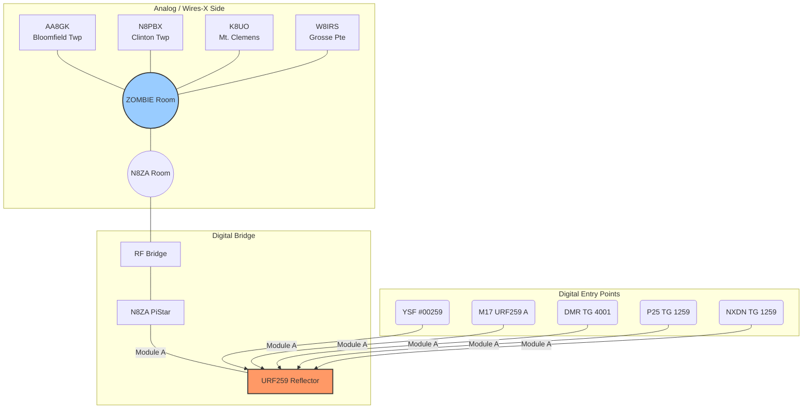

# URF259 Reflector & Repeaters

The **ZOMBIE ALERT** is a network of Fusion repeaters in the Detroit Metro area, connected to a Wires-X Room and to the **URF259 Reflector**. This system bridges multiple digital modes and analog repeaters, allowing seamless communication across platforms.

## Live Dashboard

View active users, listen to past transmissions, and see connection stats on our **[Live Dashboard](https://urf259.whocaresradio.com)**.

## Network Map

The following map shows the coverage area and locations of our linked repeaters across Metro Detroit:

| Repeater | Callsign | Frequency | Offset | Location |
| :--- | :--- | :--- | :--- | :--- |
| **Bloomfield Twp** | AA8GK | 443.8250 MHz | +5 MHz | Bloomfield Township Hall |
| **Clinton Twp** | N8PBX | 443.6750 MHz | +5 MHz | Universal Towers, Clinton Twp |
| **Mt. Clemens** | K8UO | 444.7750 MHz | +5 MHz | McClaren Hospital |
| **Grosse Pointe** | W8IRS | 444.2250 MHz | +5 MHz | Grosse Pointe Farms |

## Connection Instructions

You can connect to the URF259 network using any of the following digital modes. All modes are bridged to **Module A**.

### Digital Modes

* **Yaesu System Fusion (YSF)**: Connect to Room `#00259` (US-URF259)
* **Wires-X**: Room `#28298`
* **DMR**:
  * **Type**: MMDVM
  * **Host**: `urf259.whocaresradio.com`
  * **Port**: `62032`
  * **Talkgroup**: Key up on **TG 4001** (or 9) to link.
* **P25**: Talkgroup `1259`
* **NXDN**: Talkgroup `1259`
* **M17**: Connect to `URF259` Module `A`

## Network Topology

The URF259 network is a complex bridge of analog and digital systems. The diagram below illustrates how the various components are linked:

