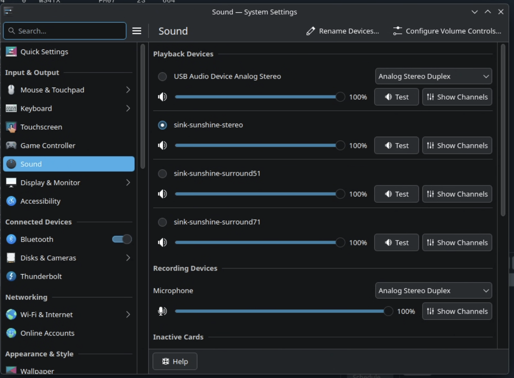
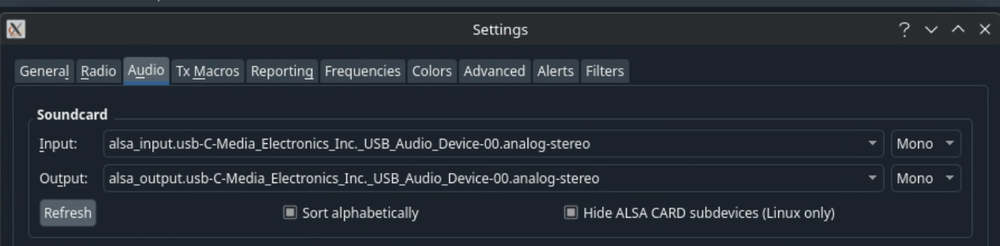

# FTX-1 and WSJTX on CachyOS

This guide provides step-by-step instructions for setting up the Yaesu FTX-1 transceiver with WSJTX-Improved on CachyOS Linux.

---

## Part 1: Install Dependencies

### 1. Install yay AUR Helper

First, install `yay` from the official CachyOS/Arch repositories:

```bash
sudo pacman -S yay
```

### 2. Install Hamlib (Git Version)

Install the latest hamlib-git package using yay:

```bash
yay -S hamlib-git
```

---

## Part 2: Build and Install WSJTX-Improved

### 1. Download the WSJTX-Improved AUR Package

Download the package build files from AUR:

```bash
# Create a directory for AUR builds
mkdir -p ~/aur
cd ~/aur

# Clone the WSJTX-Improved package
git clone https://aur.archlinux.org/wsjtx-improved.git
cd wsjtx-improved
```

### 2. Modify the PKGBUILD

Edit the `PKGBUILD` file to adjust the hamlib dependency:

```bash
nano PKGBUILD
```

Find the line that reads:

```
'hamlib>=4.5'
```

And change it to:

```
'hamlib'
```

The diff should look like this:

```diff
@@ -10,7 +10,7 @@ url="https://sourceforge.net/projects/wsjt-x-improved/"
 license=('GPL3')
 depends=(
        'fftw'
-       'hamlib>=4.5'
+       'hamlib'
        'libusb'
        'portaudio'
        'qt5-base'
```

### 3. Build and Install

Build and install the package:

```bash
makepkg -si
```

This will compile WSJTX-Improved and install it along with all required dependencies.

---

## Part 3: Connect the FTX-1

### 1. Plug in the USB Cable

Connect the USB cable from your Yaesu FTX-1 to your computer.

### 2. Verify the Connection

Check that the USB serial device is detected:

```bash
# List USB devices
lsusb

# Verify the serial port exists
ls -l /dev/ttyUSB*
```

You should see `/dev/ttyUSB0` (or a similar device) listed.

---

## Part 4: Verify Hamlib Support for FTX-1

Check that hamlib recognizes the FTX-1:

```bash
rigctld --list | grep FTX
```

Expected output:

```
  1051  Yaesu                  FTX-1                   20241118.1      Alpha       RIG_MODEL_FTX1
```

---

## Part 5: Start the Rig Control Daemon

### 1. Start rigctld-wsjtx

In a terminal, start the rig control daemon:

```bash
rigctld-wsjtx -m 1051 -p /dev/ttyUSB0 -vvvv
```

**Parameters:**
- `-m 1051`: Model number for FTX-1
- `-p /dev/ttyUSB0`: Serial port device
- `-vvvv`: Verbose output for debugging

### 2. Optional: Use tmux for Persistence

If you want the daemon to persist across disconnects, use tmux:

```bash
# Install tmux if not already installed
sudo pacman -S tmux

# Start a new tmux session
tmux new -s rigctld

# Run rigctld in the tmux session
rigctld-wsjtx -m 1051 -p /dev/ttyUSB0 -vvvv

# Detach from tmux: Press Ctrl+b, then d
# Reattach later: tmux attach -t rigctld
```

---

## Part 6: Configure WSJTX Radio Settings

### 1. Open WSJTX

Launch WSJTX-Improved from your application menu or terminal:

```bash
wsjtx
```

### 2. Configure Radio Settings

Go to **File** → **Settings** → **Radio** tab and configure as shown:


**Key settings:**
- **Rig**: Hamlib NET rigctl
- **Network Server**: (leave empty or use localhost)
- **Baud Rate**: 4800
- **PTT Method**: CAT
- **Port**: `/dev/ttyACM0` (or your device)
- **Mode**: Data/Pkt
- **Split Operation**: Fake It

### 3. Test the Connection

Click the following buttons to verify:
- **Test CAT**: Should show successful connection
- **Test PTT**: Should trigger PTT on the FTX-1

---

## Part 7: Configure Audio Settings

### 1. Configure KDE Sound Settings

Right-click the speaker icon in the system tray and select **Audio Volume** → **Configure Sound Devices**.

In the Sound settings:
- **Playback Devices**: Select **USB Audio Device Analog Stereo** and set profile to **Analog Stereo Duplex**
- **Recording Devices**: Select **USB Audio Device Analog Stereo** and set profile to **Analog Stereo Duplex**



### 2. Configure WSJTX Audio Settings

Go to **File** → **Settings** → **Audio** tab in WSJTX and configure as shown:



**Settings:**
- **Input**: `alsa_input.usb-C-Media_Electronics_Inc._USB_Audio_Device-00.analog-stereo`
- **Output**: `alsa_output.usb-C-Media_Electronics_Inc._USB_Audio_Device-00.analog-stereo`
- Both set to **Mono**

---

## Troubleshooting

### Serial Port Permissions

If you get permission errors accessing `/dev/ttyUSB0`, add your user to the `uucp` group:

```bash
sudo usermod -aG uucp $USER
```

Log out and log back in for the change to take effect.

### No Audio

- Verify the USB audio device is selected as the default in KDE Sound Settings
- Check that WSJTX audio device names match those shown in `pavucontrol` or KDE Sound Settings
- Ensure volume levels are not muted

### CAT Control Not Working

- Verify `rigctld-wsjtx` is running
- Check that the correct serial port is specified
- Ensure the FTX-1 is powered on and connected

---

## Summary

You should now have a working setup with:
- WSJTX-Improved connected to your FTX-1 via hamlib
- CAT control for frequency and mode changes
- PTT control via CAT
- Audio routing through the USB audio interface

You're ready to start making digital mode contacts!
